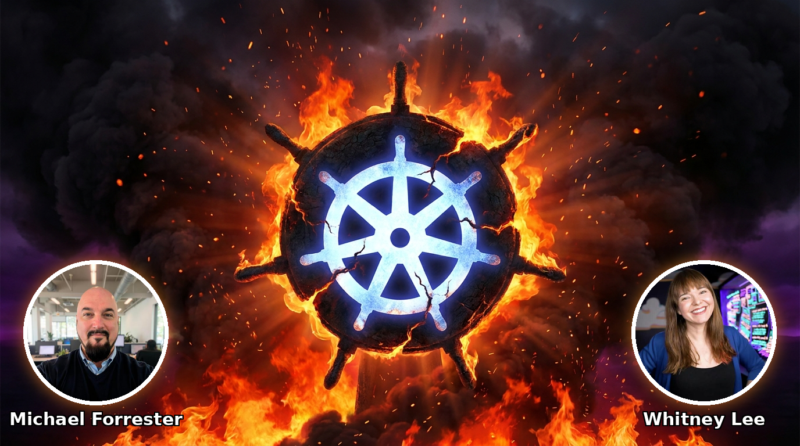

# Build a Platform, Unleash an Agent on it... and Watch it Burn! 🔥

> **Give an AI agent the keys to a real Kubernetes platform, dare it to do damage, and watch which guardrails actually stop it, and which ones just watch it burn.**

A hands-on workshop at **DevOpsDays Portland 2026** (Smith Memorial Student Union, Room 327).
Presented by **Michael Forrester** (Accenture) with **Whitney Lee**.

**TL;DR:** one lesson in three moves. First the whole room attacks a shared cluster with no
guardrails and watches the agent do damage. Then everyone gets their own cluster and works eight
challenges, installing each guardrail themselves and re-running the attack to watch it die: the CNCF
controls most platform teams already run, then the guardrails specific to *agents*, the input, the output,
and the tools they can reach, because that is the part existing tooling cannot see.

## What this is

You get a Kubernetes cluster that already runs a full internal developer platform: Argo CD for
GitOps, Kyverno for admission policy, Falco for runtime security, Prometheus and Grafana for
observability, plus secrets management, certificates, and a Backstage portal. You also get an AI
agent with access to that cluster.

The exercise is to make the agent do damage. Ask it to deploy a workload the policies forbid. Ask
it to give itself more permissions. Ask it to change infrastructure without going through Git. Ask
it to read a secret and hand the value back to you. Some of those attempts are stopped by the
platform. The rest get through, until you switch on guardrails meant for agents specifically.

## What you learn

Most of what an agent will try against a real platform is already handled by tools many teams run
today, such as admission control, RBAC, and GitOps. Turn the right control on and the attack stops.

What those tools cannot see is the agent's input, its output, and the tools it is allowed to reach.
That is the part agents change, and it is where this workshop spends its time. You will also watch
an unguarded agent run up a real cloud bill, because wasted tokens are their own denial-of-service
problem, and you will see which guardrail stops the spend rather than paying for it after the fact.

## How the session runs

The workshop runs two hours (Tue Sept 8, 2026, 1:00 to 3:00 PM Pacific, Room 327) in three moves.

1. **The Community cluster.** The whole room points at one shared cluster, `attackme.agenticburn.com`,
   which runs with no guardrails at all. Everyone attacks it together: talk the agent into leaking the
   CEO's home address, and watch the room's own attempts show up by name in Datadog.
2. **Provisioning.** Each attendee claims their own cluster by email. It starts with the guardrails
   uninstalled.
3. **The eight challenges, on your own cluster.** You run each attack, watch it work, then install the
   control yourself and run the same attack again to watch it die. The first three are CNCF platform
   controls (NetworkPolicy egress, a Kyverno registry allow-list, KubeArmor runtime enforcement). The
   rest are the guardrails specific to agents: a budget cap, an output filter, an input filter, the tool
   allow-list, and the agent's own RBAC.

You work in a browser. Each cluster gives you a chat window to your agent (BurritoBot, the burrito-ordering
app you are attacking), an in-browser terminal, and a Datadog login to watch what the agent did. No local
install is required.

## What you take home

- This repository. It is the platform as code, so you can hand it to a coding agent and stand up
  something close to production.
- A governance map that lists each attack, the control that stops it, the layer it sits in, and
  whether existing tooling already covers it.
- A checklist you can run against your own platform to find the gaps.
- A walkthrough of how the session is run, as a reveal.js deck (`railway/walkthrough/`, hosted at
  walkthrough.agenticburn.com) — the run-of-show in delivery order, with facilitator detail in the notes.

## The stack

Everything here is CNCF or open source. Each cluster is independent and take-home: its own in-cluster
Argo CD reconciles the whole platform from a single app-of-apps against the local cluster, with no hub
and no central control plane.

- GitOps: Argo CD
- Policy: Kyverno (incl. registry allowlist, PID limit, cosign image signing)
- Runtime security: Falco, Falcosidekick, and Falco Talon (detect and respond)
- Service mesh and identity: Istio ambient (mTLS, SPIFFE workload identity)
- Secrets and certificates: External Secrets Operator, cert-manager
- Observability: Datadog (primary), with Prometheus, Grafana, Tempo, Loki, OpenTelemetry as the fallback
- Developer portal: Backstage
- Agent: kagent (a CNCF project) on Amazon Bedrock
- AI guardrails: LLM Guard, agentgateway (MCP authorization)

Pinned versions are in [`VERSIONS.lock`](VERSIONS.lock).

## Repository layout

| Path | Contents |
|---|---|
| `gitops/` | Argo CD app-of-apps: the whole platform as code |
| `gitops/ai-layer/` | the agent and the AI guardrails (kagent, LLM Guard, MCP) |
| `policies/kyverno/` | the admission policies |
| `security/`, `observability-idp/`, `backstage/` | the platform foundation |
| `agent/`, `challenges/` | guardrail sources and the attack content |
| `games/` | the attendee challenges (Cluster-3 games; the S3 "exfil basketball" game is CUT, see `games/eso-s3-exfil/CUT.md`) |
| `infra/` | cluster provisioning, bootstrap, and demo DNS (agenticburn.com) |
| `verify/` | the verification scripts + the offline render-gate test suite |
| `facilitation/` | run-of-show, governance map, self-assessment, the question tracker |
| `docs/` | build spec, build plan, abstract, design decisions, and the stack walkthrough |

## Safety

Everything here is synthetic. Planted secrets are obviously fake and carry a `FAKE-` prefix. No real
credential goes into a cluster, a trace, or a recording. The clusters are disposable on purpose.
